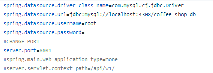

# Steps to run the Sprint Boot Rest API

- ### Prerequisite

 1. Wamp/xampp server
 2. IDE(IntellijIDEA/Eclipse)
 3. Soup UI/ Postman
 
 - ### Steps
 
 1. Start Wamp/xampp server
 2. Import coffee_shop_db.sql to phpMyAdmin
 3. Open coffee shop system in the IDE
 4. Go to src/main/resources/application.properties and change or reuse the server.port

 
 
 
 5. Run the project in IDE (if port changed save the project)
 6. Open Soup UI/Postman and test endpoints as bellow ( use "localhost:portnumber")
 

# End points 

- Bakery Types
1. /bakeryTypes - Fetch all bakery types from database - (GET)
2. /bakeryTypes/ID - Fetch bakery types by ID - (GET)
3. /bakeryTypes - Insert bakery types to the database - (POST)
4. /bakeryTypes - Update bakery types from database - (PUT)
5. /bakeryTypes/ID - Delete bakery types by ID - (DELETE)

- Coffee items
1. /coffeeitems - Fetch all coffee items from the database - (GET)
2. /coffeeitems/ID - Fetch coffee items by ID - (GET)
3. /coffeeitems - Insert coffee items to the database - (POST)
4. /coffeeitems - Update coffee items from database - (PUT)
5. /coffeeitems/ID - Delete coffee items by ID - (DELETE)
